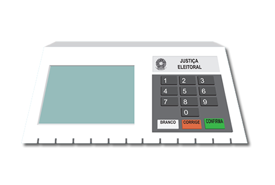
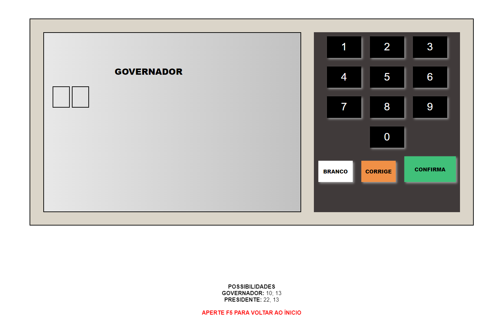
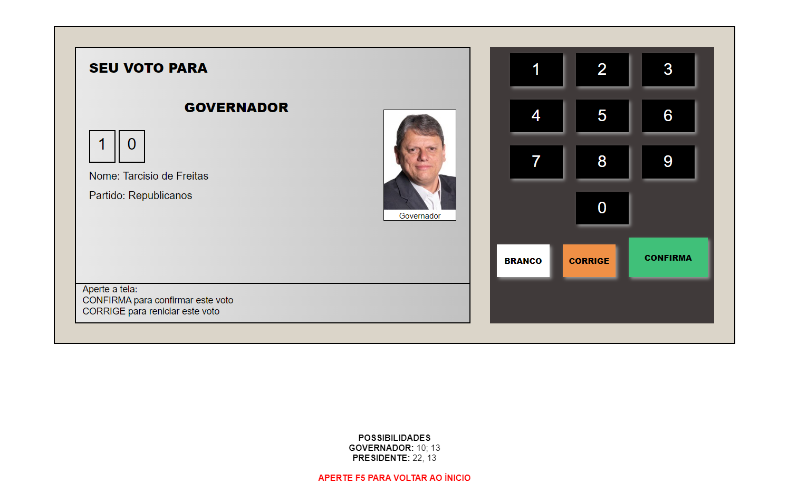
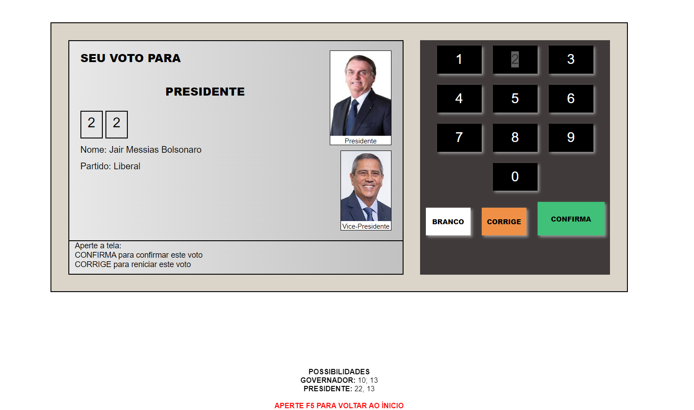
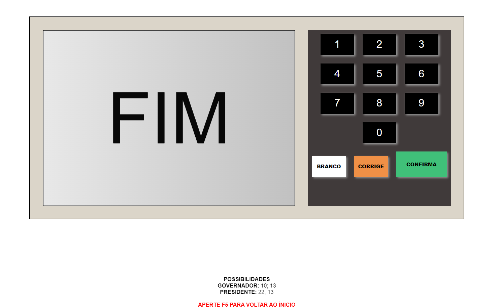

<h1 align="center">

</h1>

# 🎆BRAZILIAN ELETRONIC URN SYSTEM

### 📚 ABOUT

Projeto **Front-End** com o **intuito acadêmico**, para aprendizado da linguagem de programação **JavaScript**. Esse projeto consiste na criação de uma urna eletrônica contendo as **numerações de 0 à 9**, e os botões, **"LIMPA"**, **"BRANCO"**, e **"CONFIRMA"**, com apenas 4 candidatos existentes, 2 para governador e 2 para presidente. (**ATENÇÃO:** Site não responsivo devido a fidelidade com a urna eletrônica brasiliera, podendo ser **vizualizado fielmente apenas em computadores e laptops**)

### 🔨 TOOLS
- HTML5
- CSS3
- JavaScript

### 📸 IMAGES

 
 
 

 
 
 

 
 
 

